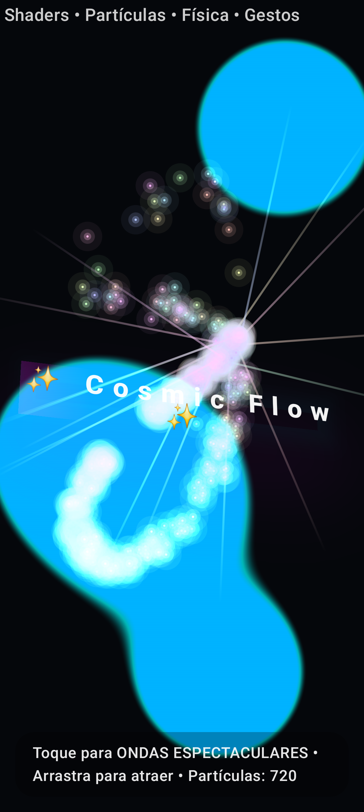
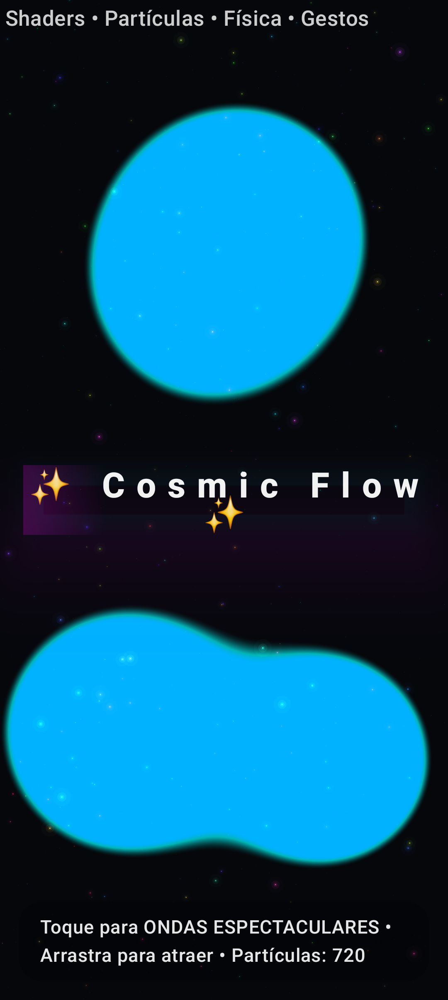

# 🌌 Cosmic Flow

A visually captivating Android app featuring dynamic particle effects, fluid metaballs, and interactive touch ripples — powered by Jetpack Compose and AGSL shaders.

Cosmic Flow explores advanced graphics techniques on Android, combining the flexibility of Jetpack Compose with the performance of AGSL (Android Graphics Shading Language) to create immersive, fluid, and futuristic visuals.
## 🖼️ Visual Showcase

| Particle Field                    | Metaballs Background              |
|-----------------------------------|-----------------------------------|
|  |  |

| Touch Ripples                     | Interactive Title                 |
|-----------------------------------|-----------------------------------|
|  |  |

---

## ✨ Features

- **🎇 Dynamic Particle Field** – A responsive field of particles flowing through a noise field and reacting to touch, creating organic motion patterns
- **🔮 Metaballs Background** – Smooth, lava-lamp-style animations rendered with custom AGSL shaders for fluid visual effects
- **🌊 Spectacular Touch Ripples** – Multi-layered ripple effects with sparkles and distortions triggered by screen interactions
- **🎭 Interactive Title Screen** – Subtle tilting title with reactive spotlight effect that follows user input
- **🕹️ Controls Overlay** – Lightweight UI layer for real-time parameter adjustment and system information display
- **🌈 Fallback Gradient Background** – Ensures beautiful animated gradients on devices without AGSL support
- **⚙️ Customizable Components** – All colors, speeds, intensities, and counts are externalized for easy experimentation

## 🛠️ Tech Stack

- **🟣 Kotlin** – Primary programming language
- **🟦 Jetpack Compose** – Modern Android UI toolkit for declarative UI development
- **✨ AGSL (Android Graphics Shading Language)** – High-performance custom shaders for advanced visual effects
- **🔄 Coroutines** – Smooth animations and asynchronous task handling
- **🖥️ Android Studio** – Official development environment

## 🚀 Getting Started

### Prerequisites

- **Android Studio**: Ladybug (2024.2.1) or newer
- **Android Version**: 7.0 (API 24) or higher
- **Recommended**: Physical device for optimal performance

### Installation

1. **Clone the repository**
   ```bash
   git clone https://github.com/yourusername/cosmic-flow.git
   cd cosmic-flow
   ```

2. **Open in Android Studio**
    - Launch Android Studio
    - Select "Open an Existing Project"
    - Navigate to the cloned directory

3. **Build and Run**
   ```bash
   ./gradlew installDebug
   ```
   Or use Android Studio's run button to deploy to your device/emulator.

## 🎮 User Interaction

| Action | Effect |
|--------|--------|
| **Tap** | Triggers spectacular multi-layer ripple effects with sparkles |
| **Drag** | Attracts nearby particles, creating dynamic flow patterns |
| **Long Press** | *(Future feature)* |

The overlay displays real-time information including particle count and performance metrics.

## 🎨 Customization

Fine-tune the visual experience by modifying parameters in the [`config/`](app/src/main/java/dev/pgm/cosmic_flow/config/) package:

- **Colors**: Particle hues, background gradients, ripple tints
- **Animation**: Speed multipliers, particle counts, ripple intensity
- **Behavior**: Touch sensitivity, particle attraction strength, fade rates

## 🖼️ Visual Showcase

> **Note**: Add screenshots or GIFs here to demonstrate:
> - 🎥 Particle field dynamics in motion
> - 🔮 Fluid metaballs background animation
> - 🌊 Touch ripple effects cascade
> - 🎭 Interactive title screen with spotlight

## 📂 Project Architecture

```
cosmic-flow/
├── app/
│ └── src/main/java/dev/pgm/cosmic_flow/
│ ├── cosmic_flow.kt # Application entry point (Compose setup)
│ ├── MainActivity.kt # Main activity hosting Compose content
│ ├── components/ # Reusable UI building blocks
│ ├── config/ # Tweakable constants and parameters
│ ├── models/ # Data models for particles and rendering
│ ├── ui/ # Compose screens and entry points
│ │ └── theme/ # Color palette and typography
│ └── utils/ # Helper utilities and extensions
├── build.gradle.kts # Root build configuration
└── settings.gradle.kts # Project settingsttings
```

## 🔧 Performance Considerations

- **AGSL Shaders**: Optimized for modern Android devices with GPU acceleration
- **Fallback Support**: Graceful degradation on older devices without AGSL support
- **Memory Management**: Efficient particle pooling and resource cleanup
- **Frame Rate**: Targets 60 FPS with adaptive quality scaling

## 🤝 Contributing

Contributions are welcome! Please feel free to submit issues, feature requests, or pull requests.

1. Fork the repository
2. Create a feature branch (`git checkout -b feature/amazing-feature`)
3. Commit your changes (`git commit -m 'Add amazing feature'`)
4. Push to the branch (`git push origin feature/amazing-feature`)
5. Open a Pull Request

## 📄 License

This project is licensed under the MIT License - see the [LICENSE](LICENSE) file for details.

## 🙏 Acknowledgments

- Inspired by fluid dynamics and particle system research
- Built with the amazing Jetpack Compose framework
- Special thanks to the Android graphics community

---

**✨ Experience the cosmic flow - where code meets art ✨**